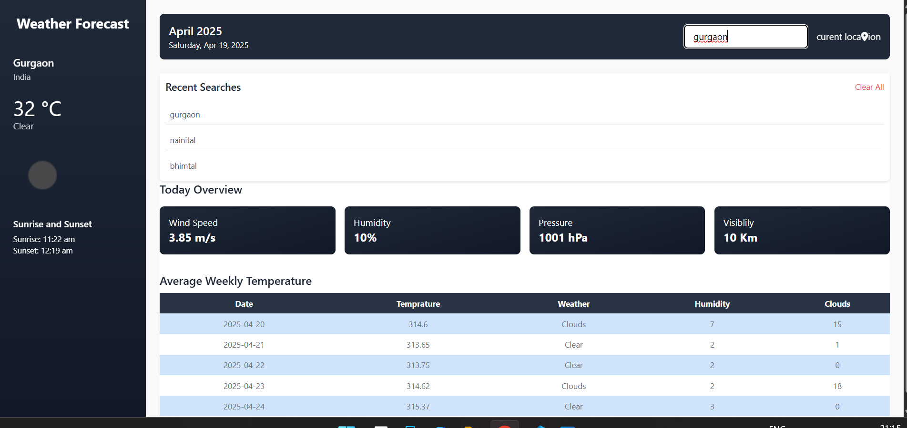

# 🌦️ Weather App

A simple and responsive weather application built using **HTML**, **Tailwind CSS**, and **JavaScript**. It fetches real-time weather data using the **OpenWeatherMap API** and allows users to search weather by city or use their current location.

---

## ✨ Features

- 🌍 Get weather info by city name
- 📍 Get weather based on current location
- 🧭 Shows temperature, weather conditions, humidity, wind, and more
- 🗓 Displays current date and time
- 🖼 Dynamic weather icons
- 📱 Fully responsive (supports iPhone SE and iPad Mini)
- Shows upto 3 recent searhed cities...

---

## 📸 Screenshot



---

## 🚀 Tech Stack

- **HTML**
- **Tailwind CSS**
- **Vanilla JavaScript**
- **OpenWeatherMap API**
- **Geolocation API**

---

## 🔧 Installation
1. Gihub link:
    [to repo](https://nav-weath.netlify.app/))
2. Clone the repository:
    
   ```bash
   git clone https://github.com/your-username/weather-app.git
   cd weather-app

## 💻 Deloymenet
- Website Link:
  [weather-app](https://nav-weath.netlify.app/)
